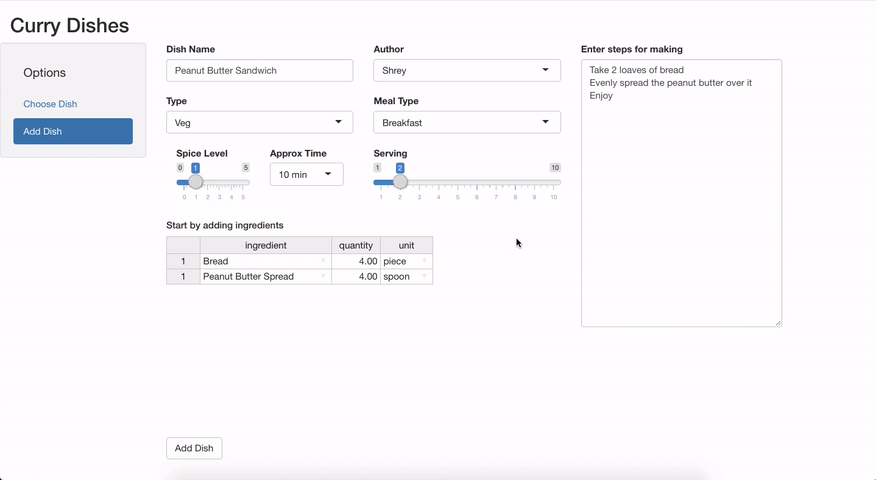
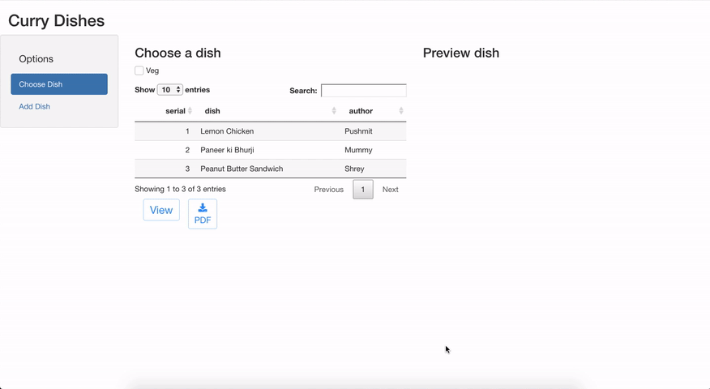

# curry-dishes

Created this fun project to help myself bring my inner cook to life as I travel to a new continent for my masters program

This app will help me keep all my dishes in one place. 

- I have added the functionalites to add a dish / view / and download them as nicely formatted pdf documents for the purpose of sharing
 
- This is a Shiny App with which uses R Markdown to render the pdf 

## Easily add dish details with steps 

## View the nicely formatted pdf with detailed intstructions in the browser (also download it as a pdf)

